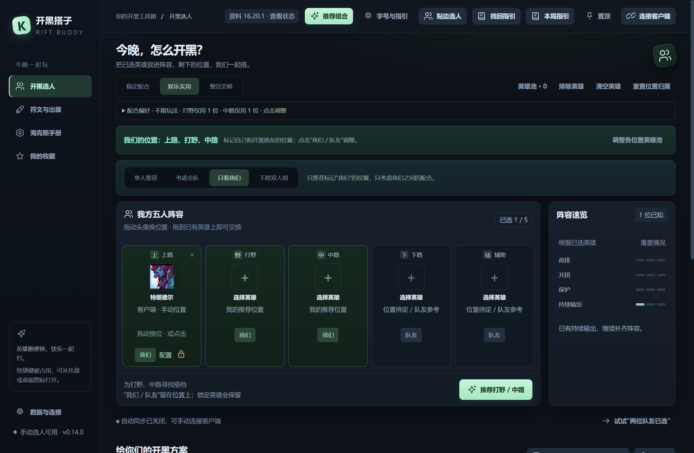
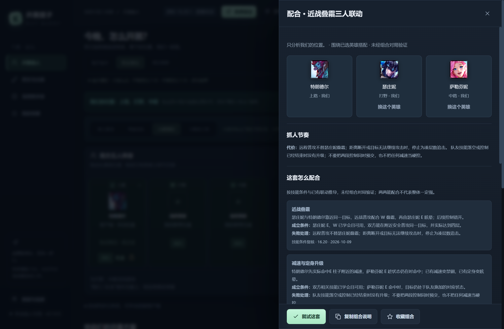
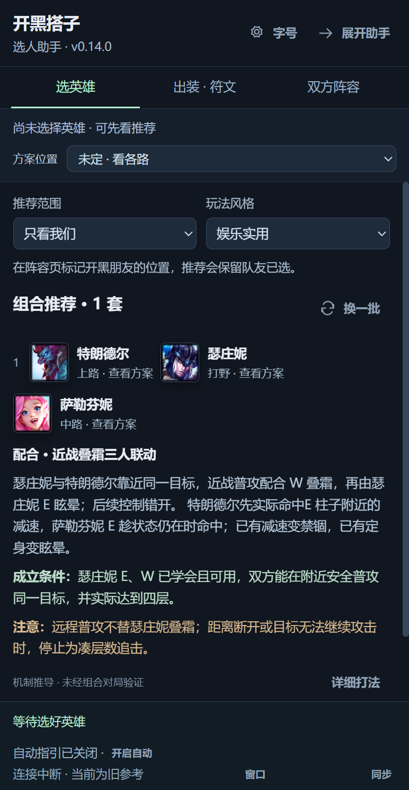

# 开黑搭子 · Rift Buddy

给朋友一起玩匹配准备的 Windows 桌面助手：根据已经选好的英雄推荐三人组合或下路双人组，把对应的玩法、出装和符文带到本局指引中。

**[下载 v0.14.0 Windows 预览版](https://github.com/Legender134/rift-buddy/releases/tag/v0.14.0)** · [全部版本](https://github.com/Legender134/rift-buddy/releases) · [使用说明](使用说明.txt) · [组合库维护说明](组合库维护说明.txt)

继续开发请看 [开发指南](docs/development.md) 和 [贡献说明](CONTRIBUTING.md)。仓库包含完整源码、离线资料、依赖锁文件、测试和打包工具；无需额外获取开发者的本机文件。

目前面向国服端游、召唤师峡谷匹配与海克斯大乱斗。手动选人和离线推荐可以直接使用；国服真实选人持续同步、全屏游戏中的指引体验和真实符文应用仍待实战验收，请勿把模拟测试结果视为国服实测证明。



以上及下方图片均截取自已发布的 v0.14.0 桌面程序，使用 `16.20.1` 离线资料和隔离的演示选人，不代表真实对局验收。

<details>
<summary>查看当前版本的组合条件与选人侧栏</summary>

组合详情展示成员分工、技能成立条件和失败处理：



选人侧栏可直接查看推荐，切换出装、符文与双方阵容：



</details>

## v0.14.0 的组合推荐与配置衔接

- 围绕已锁定的朋友补全跨路线双排或三人组合，保留手动位置、英雄池、禁选与公开选人限制；考虑全队时，其他队友的组合不会替代朋友的机制方案。
- 原有 200 套下路组合和 68 套三人组合继续保留。新增 8 类技能条件联动，可扩展到 171 对英雄关系，其中 151 对为原两两联动库之外的新关系；它们是条件推导，不是 171 套经过实战验证的组合，也没有组合胜率。
- 补全特朗德尔、奥拉夫、菲奥娜、泰达米尔、瑞兹、伊泽瑞尔和艾瑞莉娅的持续输出职责；9 个单人线位置改用各自的开局与阶段分工。来源位置样本刷新后使旧结果与未完成推荐失效，侧栏重新计算。
- 已命中规则的机制搭配说明包含技能顺序、成立条件和失败处理。接受、收藏、成员配置、本局指引与重启后继续使用原说明；成员或位置变化时原方案失效，旧版本说明仍保留并标明版本。未命中的普通生成结果仍可能只有通用阵容建议，尚不具备同等完整的成员合作计划。
- 出门装备、鞋子、核心、后期装备和完整符文可分别选择并保存；自选鞋子保留，恢复默认后再按条件调整。下路任务后的额外装备计划需要在指引中确认实际任务完成。
- 当前方案可导出或点击写入本机装备集；只更新助手自身的装备集，写入结果与客户端商店识别分别说明。
- 可选择公开对手比较完整符文与核心路线的机制取舍；这些同位置样本不会被说成该对手的专门统计。未确认对局时保留选择，确认新局后清除旧局绑定。

本版仍为预览版。真实国服连续对局、符文实际写入和不同显示环境的稳定性待实战验收；对手专门配置覆盖与组合数据仍需继续扩充。斩杀线计算由其他开发者接手，本版未扩展其计算模型。

## v0.13.0 的推荐与选人体验

- 选人时自动显示侧栏，可直接比较出装、符文、加点与双方阵容，单人位置未确认时不猜分路。
- 支持 OP.GG 全球/韩国与黄金/翡翠/钻石及以上来源筛选；切换读取本机缓存，点击刷新才联网。旧版本方案继续保留并标明版本。
- 309 套离线位置配置覆盖当前规则支持的 266 个英雄位置，另外保留来源公布的其他位置；显示公开对阵样本；显示来源、样本量与区间，不把整局胜率当成对线优势。
- 173 位英雄有各自的开局、团战、连招条件与技能说明；和开黑组合的分工、出装及符文选择一起查看。人工行动笔记保留自身整理版本，基础资料升级时不会自动标为已复核。
- 已验证的来源位置可进入推荐候选，保留英雄池、排除和“常规位置”筛选。切换到尚无缓存的来源时，无蓝耗法师的机制备选避免法力核心装备。
- 符文页比较以当前选择为基准，展示改选、放弃及属性碎片变化，可展开查看实际符文效果；准备方案、双方组合成员配置和收藏支持重启恢复。
- 200 套下路组合补充前期、关键配合、后期的两人分工、行动窗口、退出条件与经济安排；查看组合、配置、侧栏、指引或复制说明时可继续使用。亚索接击飞、发条送球、千珏与宝石保护接力等另有配对条件；这些是机制整理，不代表已验证的组合胜率。
- 侧栏首屏显示当前核心装备、完整符文概要与加点。可手动选择公开对手，查看 16 位重点对手的试探、进场、退场条件与配置取舍；未整理的对手保留通用打法并说明缺口，不猜分路或读取敌方冷却。
- 点击应用时替换一张可编辑符文页，没有可编辑页才新建；不会改动客户端只读预设页。
- 新增 Windows 安装程序。安装和卸载保留个人收藏、偏好及缓存；也可继续使用完整 ZIP。

本版本发布侧重组合、符文、出装与窗口体验。斩杀线后续开发单独交接，未完成的计算实验不进入这个发布候选。真实国服连续对局、独占全屏与真实符文应用仍未完成本版本实测。

## 下载与使用

1. 到 [Releases](https://github.com/Legender134/rift-buddy/releases) 下载对应版本的 Windows x64 安装程序或 ZIP。下文功能说明对应当前源码，下载包的版本以发布页为准；普通用户无需安装 Node.js、pnpm 或开发工具。
2. 安装程序会创建桌面快捷方式；选择 ZIP 时，解压整个文件夹并双击 `开黑搭子.exe`。不要只复制一个 exe，也不要直接在压缩包里运行。
3. 手动选择英雄即可使用。连接客户端时，先启动并登录英雄联盟；在助手中点击“连接客户端”，必要时在“数据与连接”填写游戏安装位置。
4. 在五个位置下标记“我们 / 队友”，拖动英雄头像调整位置，再选择推荐范围和娱乐偏好。
5. 打开组合详情查看分工、执行顺序、风险与各人的出装符文；点击“本局指引”将配置带入小窗。

适用环境：Windows 10/11 x64。当前发布包未做代码签名，下载文件的 SHA-256 校验值随 Release 提供。

快捷键：

| 快捷键 | 功能 |
| --- | --- |
| `Ctrl + Shift + Space` | 呼出 / 隐藏主窗口 |
| `Ctrl + Shift + G` | 展开收起的指引；完整窗口时呼出 / 隐藏 |
| `Ctrl + Shift + H` | 切换指引的鼠标穿透 / 可交互状态 |

关闭主窗口后会继续在托盘运行；从托盘可打开窗口或退出。快捷键被占用时也可从托盘操作。

## 开黑推荐

- 支持所有位置。已选英雄默认锁定，推荐保留锁定英雄；选人信息可以手动填写，也可以从本机客户端的公开数据同步。
- 拖到空位置换位，拖到已有英雄上交换位置。“我们 / 队友”归属留在位置上。助手里的调整只用于分析，正式位置交换需要在游戏客户端完成。
- **考虑全队**：只推荐我们负责的位置，同时考虑其他队友已经选择的英雄。
- **只看我们**：只分析我们之间的配合。
- **下路双人组**：专门推荐下路与辅助的搭配。
- 支持稳定配合、娱乐实用、整活尝鲜，以及英雄池、难度、玩法节奏、非常规位置和近战下路等偏好。
- 当前源码内置 200 套下路组合、68 套三人组合、54 套玩法配置；可搜索、收藏、新建个人组合，并为成员选择专用配置。

组合推荐使用整理的机制联动、位置匹配和阵容结构规则；显示的匹配评分不是胜率，也不是统计上的最优解。公开出装来源包含全球服排位参考，不代表国服匹配数据。

## 出装、符文与本局指引

支持常规位置配置、组合专用玩法、多套符文与出装路线。配置选择按英雄、位置、模式和组合自动保存在本机，退出重开后继续使用；切换搭档后不会直接套用另一套组合的专用配置。组合收藏同时保存成员的装备、符文和加点，载入后恢复各人的选择；可以单独查看成员配置，或用最近选择更新收藏。旧收藏继续保留。

当前源码的离线快照覆盖 173 名英雄、309 个英雄位置，旧版本参考单独说明。单位置最多 15 条不同核心路线、18 套完整符文和 5 条来源加点序列。按用途与样本说明选择，更多方案可展开；组合可指定宝石早期第二点 Q、延后 R 等技能节点。来源没有提供的样本或后续技能点不会补造，稀有位置可能只有少量方案。

指引提供前期购买目标、核心装备与配件、加点提示、组合分工和行动步骤。局内公开数据可用时识别实际装备与游戏时间；不可用时继续显示准备好的方案，并标明数据状态。鼠标穿透、自动呼出以及结束后隐藏 / 折叠 / 保留均可调整。

v0.10.4 移除悬浮球入口，紧凑窗口保留购买与加点，并提供明确的“展开”按钮。购买内容使用一个滚动区域；伤害参考另页查看，先选对手，不用通用技能公式给出胜负或危险提示。全队公开装备只生成局势备选，自动更换回城目标还需你选定重点对手或标记实际压力。买得起组件不会被说成成装已够钱，满背包时先确认合成或腾格。

v0.10.5 选人侧栏直接提供出门装、完整成装路线、符文六项及属性碎片、加点和召唤师技能。装备路线、符文、加点和对线条件可原地调整，进入游戏沿用同一准备方案；底部固定提供本局英雄的符文替换按钮。选定英雄后自动展示方案，推荐卡片可原地预览其他英雄；双方阵容展示我方覆盖、公开敌方及禁选。侧栏有空间时加宽到 440 DIP，保持客户端窗口不变。

本人预选英雄时侧栏即可展示方案，并标明尚未选定与参考位置。相同英雄、位置和模式的预选调整会带入实际选定；手动浏览其他英雄时保留浏览内容。符文方案自动准备，写入仍由用户点击。

局内“双方 / 数据”显示公开等级、正式位置、K/D/A、补刀、CS/min 和装备。未确认的位置与缺失数据留空，装备标价不当作实际获得的金币。“窗口检查”可从侧栏或设置打开，查看屏幕缩放和公开窗口外框；复制报告需点击，外框与按缩放换算的像素参考不等于游戏渲染分辨率。

伤害参考按计算范围说明：永恩有技能与持续普攻模型，薇恩仅复核普攻与 W，艾希仅复核普攻与被动；大虫子和盖伦另有单次 R 参考。其余英雄仍有未完成的被动与持续技能模型，海克斯及峡谷 19 级以上暂不显示伤害数字。公开接口没有对手当前生命和技能冷却，所有输出参考均不作立即斩杀判断。

v0.10.0 提供局势建议：每次局内刷新结合金币、背包、双方公开装备与战绩，提供护甲、魔抗、穿透和重伤备选，说明触发依据、用途与取舍。手动回城目标优先，手动选定的局势备选会保留至购买、升级或重新选择；背包已满或已有组件足以完成核心时不会自动插入防御小件。可关闭自动建议，也可继续手动标记局势。

加点建议遵守当前等级、技能等级和剩余技能点，并解释为什么选这一个技能。拉克丝、莫甘娜、璐璐、迦娜、娜美、索拉卡的辅助保护，以及墨菲特、阿木木的物理承伤提供机制备选；其他英雄沿准备好的加点顺序，专用组合保留自己的方案。特殊加点机制或资料缺失时提示按游戏内选项判断。建议基于机制规则，不代表最优配置；不会自动购买装备或加点。

符文应用必须由用户在助手里主动点击。点击后直接替换一张可编辑符文页，优先复用上次写入的页，其次使用当前选中的页，再使用第一张可编辑页；没有可编辑页时才新建。替换前不备份原方案，客户端只读预设页不可修改。助手不会替你选英雄、操作技能或购买装备。

## 更新资料和组合库

基础资料与图片有离线快照。当前内置资料版本为 `16.20.1`，与国服的更新时间可能不同，实际效果以客户端为准。联网检查失败时继续使用已有资料；资料版本变化不会把旧套路自动标成已复核。

在“数据与连接”可检查资料、导入 JSON 组合包、预览变化并回退。个人组合、收藏与手动位置独立保存。

v0.10.0 的“资料依赖复核”比较关联技能、装备价格/合成/属性和符文说明，列出受影响的组合。即使版本号没变也可提示资料修订；不会自动把旧套路标成已复核。核心路线收藏按装备组合识别，来源排序变化时保留原选择，条目消失时提醒重新确认。

可选的组合包地址：

```text
https://raw.githubusercontent.com/Legender134/rift-buddy/main/src/core/catalog-data.json
```

将它填入“自选组合包地址”，保存后点击“检查组合更新”。它跟随本仓库维护的内容更新，不会自动检索或生成新套路。应用前先看变化，更新失败保留原库。

维护者修改 [catalog-data.json](src/core/catalog-data.json) 后，运行 `pnpm catalog:validate` 和 `pnpm catalog:audit`。每套组合应保留来源、整理版本、复核日期、分工和风险；每名成员的专用装备与符文也要单独复核。具体字段见 [组合库维护说明](组合库维护说明.txt)。

## 本机连接与数据

客户端连接仅使用本机回环地址。程序不读游戏进程内存、不自动输入、不采集战绩、不上传游戏数据，没有账号、订阅或分析埋点。

设置保存在当前 Windows 用户的 `%APPDATA%\开黑搭子` 中；下载包和仓库不包含开发者的个人设置、客户端凭据、连接会话或测试记录。遇到客户端权限不足时，只按程序提示启动本机连接助手，不需要把密码或令牌发给维护者。

反馈问题可到 [Issues](https://github.com/Legender134/rift-buddy/issues)，描述操作步骤、客户端阶段和资料版本即可。请勿上传客户端 `lockfile`、连接会话文件或带有令牌的日志。

## 从源码运行

需要 Windows x64、Node.js 24 和 pnpm 11.25.0。打包时会使用 Windows 自带的 .NET Framework 4.x 编译器构建本机连接启动器。

```powershell
git clone https://github.com/Legender134/rift-buddy.git
cd rift-buddy
npm install --global pnpm@11.25.0
pnpm install --frozen-lockfile
pnpm test
pnpm check
pnpm start
```

仅浏览手动选人界面可运行 `pnpm preview`，访问终端给出的本机地址。浏览器预览不提供客户端连接、符文写入或原生局内窗口。

打包：

```powershell
pnpm package
node scripts/inspect-package.mjs --verify-current
node scripts/smoke-package-lifecycle.mjs
```

新包输出到 `release/build-*/`，`release/latest.json` 记录本次产物。将其中的完整程序文件夹打包成 ZIP 分发；不要把自己的 `%APPDATA%` 设置目录放进去。

目录结构：`electron/` 为主进程和桥接，`src/` 为界面，`src/core/` 为推荐规则，`services/` 为连接与资料服务，`data/` 为离线快照和图片，`tests/` 为回归测试，`scripts/` 为维护、打包和模拟验收工具。

提交和 Pull Request 会在 [GitHub Actions](https://github.com/Legender134/rift-buddy/actions/workflows/ci.yml) 的 Windows 环境执行回归测试、资料检查、打包核对和模拟验收。它不连接真实游戏、不应用真实符文，也不自动发布下载包。完整操作和各类改动对应的检查见开发指南。

## 当前验收范围

v0.14.0 的最终候选通过 550 项回归测试、`pnpm check`、组合目录验证、打包内容检查和 18 项打包流程；[Windows CI](https://github.com/Legender134/rift-buddy/actions/runs/37915204176) 全部通过。数据库流程首次曾超时，独立重跑通过，原日志保留。安装程序与 ZIP 的哈希已核对，校验文件随发布提供。

这些验证使用隔离设置和模拟客户端，实际符文写入为零。常见已锁朋友的跨路合作计划、英雄职责与强势期、完整后期备选及具体对位取舍仍有缺口，成熟度审查尚未通过；当前发布不等于国服连续日用、实际符文选用、商店识别或全屏 / DPI 兼容已验证。

<details>
<summary>历史版本的测试与训练观察</summary>

v0.9.0 开发阶段完成 145 项回归测试、静态与离线图像检查，并通过 14 组打包流程检查，覆盖选人、配置、组合库维护、跨局切换、窗口生命周期和连接助手。测试使用隔离的设置与模拟客户端数据；尚未完成国服真实比赛全流程验收。

v0.9.1 修复加载游戏时丢失已确认位置、空白客户端元数据覆盖局内模式的问题，并使桌面验收脚本支持首次安装 Electron。149 项回归测试、静态与离线图片检查、打包逐文件核对，以及阶段切换、指引、多套配置、独立连接助手和完整 exe 生命周期验收通过。

2026-10-05 的国服训练测试中，连接程序读到了大厅、训练房间和短暂的选人阶段，以及四个公开的友方机器人英雄。尚未确认当前玩家锁定的英雄；真实局内装备、加点变化与全屏指引仍未完成验收。后续测试步骤见 [开发指南](docs/development.md#真实客户端验收)。

v0.9.2 根据后续国服训练实测，识别明确的 `PRACTICETOOL` 峡谷对局，并修复同局加载重连时进度清空、隐藏指引再次弹出，以及未授权选人连接时局内鼠标穿透不生效的问题。153 项回归测试、静态检查、打包核对和相关桌面验收通过。

该次阿木木训练已读取真实英雄、背包及其变化、金币、等级与技能等级；安装版指引已显示本机同步、回城购买建议、可升级技能和鼠标穿透状态。训练游戏画面中已看到指引小窗。连续选人同步、正式位置、实际技能等级变化、独占全屏兼容及真实符文应用仍待后续验证，不能把训练验收当作匹配全流程验收。

v0.10.0 完成三轮独立模型审查，修复路线补全、伤害类型判断、任务升级与互斥、购买预算、来源回退及旧收藏兼容问题。261 项回归测试、资料检查、打包核对和 6 组打包程序验收通过。本轮使用隔离设置及模拟局内数据，不代表新增功能已完成真实匹配验收。

</details>

## 素材与权利说明

本工具免费提供。第三方游戏素材、数据来源和依赖的权利说明见 [NOTICE.md](NOTICE.md)。仓库目前未声明统一的开源许可证，不应将第三方素材当成可任意再授权的内容。

开黑搭子 was created under Riot Games' "Legal Jibber Jabber" policy using assets owned by Riot Games. Riot Games does not endorse or sponsor this project.

### 资料来源与旧版本保留

当前基础资料为 `16.20.1`，离线快照包含 173 个英雄与 309 套位置配置。每套分别标明来源、版本和样本，当前来源没有发布的位置可以保留旧配置；没有来源统计时明确标为机制备选。来源最多保留 15 条不同核心路线、18 套完整符文和 5 条加点顺序，另有人工机制方案。

峡谷 16.20 统计已开放，大虫子打野包含来源丛刃页。0.10.7 起不再因来源版本较旧而丢弃方案，即使跨多个版本或赛季仍保留；刷新失败、来源不再发布该位置统计时也保留历史方案。优先采用较新统计版本，界面显示来源版本和当前资料版本；小于 200 场的路线与完整符文页标注样本较少。已移除或不可购买的装备单独跳过并提示，失效符文不写入客户端，其余配置继续使用。装备和符文分别统计；全局后期装备池作为手动备选，不再拼成来源六件套。海克斯统计已同步到 16.20，手册仍保留旧版强化参考与版本说明。
